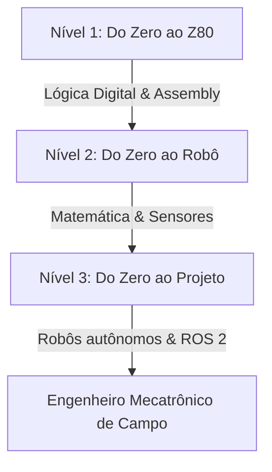

# Apêndice B: Guia do Jovem Mecatrônico

---

### ✉️ 1. Carta de Alex Senior para o Futuro Engenheiro

> *Querido piá,*
>
> *Se eu pudesse voltar ao inverno de 1986 e encontrar o guri debruçado sobre o teclado borrachento do TK90X na penumbra da sala, eu colocaria a mão no ombro dele e diria apenas uma coisa: a engenharia não é sobre saber tudo — é sobre não desistir quando nada funciona.*
> 
> *A faculdade vai tentar fazer você acreditar que a engenharia é um labirinto frio de fórmulas de Cálculo e matrizes abstratas. Não caia nessa armadilha. A matemática e o código são apenas ferramentas. A verdadeira engenharia tem cheiro de poeira de aço, calor de ferro de solda e a vibração inconfundível de um motor que gira pela primeira vez sob os seus comandos.*
> 
> *Você vai queimar transistores, travar sistemas no meio da madrugada e sentir o peso do desespero quando o código compilar mas o robô decidir bater na parede. Isso não é falha; é o processo. Cada erro é um bit de informação que o seu cérebro armazena para a próxima tentativa.*
> 
> *Mantenha os olhos curiosos, a mente aberta e o ferro de solda sempre quente.*
>
> *— Alex Senior*

---

### 🧭 2. Como Usar Este Guia
Este apêndice é um **manual de sobrevivência prática** e um mapa de estudos. Ele está dividido em trilhas de aprendizado, laboratórios práticos com código e conselhos de carreira para guiar seus passos desde o acendimento do primeiro LED até os algoritmos de controle modernos.

---

### 🗺️ 3. Três Trilhas de Estudo Prático



#### 🎚️ Trilha 1: "Do Zero ao Z80" (Arquitetura de Computadores Raiz)
* **Objetivo:** Compreender a lógica física dos chips de silício.
* **Tópicos de Estudo:**
  1. **Lógica de Bits:** Álgebra booleana, portas lógicas (AND, OR, XOR) e binários. (Ver **Cap. 3**)
  2. **Registradores e CPU:** As gavetas de dados internas e o ciclo de instrução. (Ver **Cap. 2**)
  3. **Assembly Básico:** Manipulação direta de memória com comandos como `LD`, `ADD`, `JUMP`.
  4. **Entrada/Saída (I/O):** As portas elétricas físicas de comunicação externa (`IN`, `OUT`).
  5. **Mecanismo de Interrupção:** Funcionamento de IRQs, NMIs e como a CPU salva o PC na Stack. (Ver **Cap. 5**)
* **Prática:** Baixar um emulador de Z80 e rodar códigos básicos de escrita direta nos registradores.

#### 🤖 Trilha 2: "Do Zero ao Robô" (Robótica Avançada & Espaço)
* **Objetivo:** Conectar a matemática vetorial ao movimento mecânico autônomo.
* **Tópicos de Estudo:**
  1. **Matemática do Espaço:** Coordenadas ortogonais, matrizes 3D e rotações vetoriais. (Ver **Cap. 6**)
  2. **Bin Packing:** Organização volumétrica eficiente e heurísticas como First Fit. (Ver **Cap. 6**)
  3. **Navegação (SLAM):** Localização baseada em LiDAR e odometria por encoder. (Ver **Cap. 7**)
  4. **Filtro de Kalman:** Fusão estatística de sensores ruidosos. (Ver **Cap. 7**)
  5. **ROS 2:** Nós, tópicos, publicadores e inscritos para controle robótico modular. (Ver **Cap. 8**)
* **Prática:** Implementar verificadores de colisão ortogonal em Python no simulador.

#### 🔌 Trilha 3: "Do Zero ao Projeto" (Sistemas Maker)
* **Objetivo:** Pôr a mão na massa com microcontroladores de baixo custo.
* **Tópicos de Estudo:**
  1. **Eletrônica Prática:** Lei de Ohm, multímetros, protoboards e resistores de pull-up/pull-down.
  2. **Sensores e Drivers:** Sensor ultrassônico, pontes H para motores e encoders ópticos. (Ver **Cap. 8**)
  3. **Sinal de Controle:** Técnicas de PWM para velocidade de motores e sintonia básica de controladores PID.
  4. **Integração de Sistemas:** Montagem física de um veículo terrestre diferencial de duas rodas.
* **Prática:** Criar um carrinho autônomo seguidor de linha ou desviador de obstáculos usando Arduino ou ESP32.

---

### 🧠 4. Mapa Mental de Conexão do Livro

```
[Mecatrônica Raiz] ──► [Lógica do Bit] ──► [IRQ & Stack] ──► [Espaço 3D] ──► [Navegação Autônoma]
    (Cap. 2 Z80)          (Cap. 3 AND/XOR)       (Cap. 5)          (Cap. 6)          (Cap. 7 SLAM)
                                                                                          │
[Automação Segura] ◄── [ROS 2 & Nós] ◄── [Ponte H & PWM] ◄── [Odometria] ◄────────────────┘
   (Cap. 13 Final)        (Cap. 9 Python)        (Cap. 8 Motores)    (Cap. 7 Encoders)
```

---

### 🧪 5. Mini-Laboratórios Práticos

#### 🟢 Laboratório 1: LED Pulsante (PWM Básico)
* **Objetivo:** Variar a intensidade luminosa de um LED simulando tensão analógica com PWM.
* **Materiais:** Arduino Uno, 1x LED, 1x Resistor (220 ohms), Protoboard, Cabos.
* **Esquema de Montagem:** Terminal positivo do LED no pino digital 9 (suporta PWM) através do resistor.
* **Código:**
  ```cpp
  void setup() {
    pinMode(9, OUTPUT);
  }
  void loop() {
    for (int i = 0; i <= 255; i++) {
      analogWrite(9, i);
      delay(5);
    }
    for (int i = 255; i >= 0; i--) {
      analogWrite(9, i);
      delay(5);
    }
  }
  ```
* **Erro Comum:** Esquecer de usar um pino compatível com PWM (identificado com um til `~` no Arduino).

#### 🎚️ Laboratório 2: Leitura de Sensor e Console (Portas I/O)
* **Objetivo:** Monitorar o mundo externo lendo a resposta de um sensor analógico de luminosidade (LDR).
* **Materiais:** Arduino Uno, LDR (sensor de luz), resistor de 10k ohms, cabo USB.
* **Código:**
  ```cpp
  void setup() {
    Serial.begin(9600);
  }
  void loop() {
    int valor = analogRead(A0);
    Serial.print("Luminosidade: ");
    Serial.println(valor);
    delay(100);
  }
  ```
* **Erro Comum:** A leitura analógica retornar valores erráticos devido a conexões soltas na protoboard.

#### 🏎️ Laboratório 3: Controle de Sentido do Motor (Ponte H)
* **Objetivo:** Controlar a direção de rotação de um motor de corrente contínua usando uma ponte H.
* **Materiais:** Driver Ponte H L298N, Motor CC, Fonte de alimentação externa (ex: bateria de 9V).
* **Código:**
  ```cpp
  int in1 = 4;
  int in2 = 5;
  void setup() {
    pinMode(in1, OUTPUT);
    pinMode(in2, OUTPUT);
  }
  void loop() {
    digitalWrite(in1, HIGH); // Gira para frente
    digitalWrite(in2, LOW);
    delay(2000);
    digitalWrite(in1, LOW);  // Gira para trás
    digitalWrite(in2, HIGH);
    delay(2000);
  }
  ```

#### 🌀 Laboratório 4: Contador de Pulsos de Odometria (Encoder)
* **Objetivo:** Contar a rotação da roda para calcular a distância física percorrida pelo veículo.
* **Materiais:** Microcontrolador, Encoder óptico de ranhura.
* **Código:**
  ```cpp
  volatile int pulsos = 0;
  void contarPulsos() {
    pulsos++;
  }
  void setup() {
    Serial.begin(9600);
    attachInterrupt(digitalPinToInterrupt(2), contarPulsos, RISING);
  }
  void loop() {
    Serial.print("Pulsos acumulados: ");
    Serial.println(pulsos);
    delay(500);
  }
  ```
* **Erro Comum:** Vibrações e ruídos elétricos gerarem falsos pulsos extras. Corrija usando resistores de debounce.

#### 🗺️ Laboratório 5: Simulador de Desvio e Mini-SLAM
* **Objetivo:** Mapear obstáculos frontais simulando um feixe LiDAR com sensor ultrassônico.
* **Materiais:** Sensor ultrassônico HC-SR04, Micro servo motor.
* **Código:**
  ```cpp
  #include <Servo.h>
  Servo meuServo;
  int trig = 12;
  int echo = 13;
  void setup() {
    Serial.begin(9600);
    meuServo.attach(11);
    pinMode(trig, OUTPUT);
    pinMode(echo, INPUT);
  }
  long medirDistancia() {
    digitalWrite(trig, LOW); delayMicroseconds(2);
    digitalWrite(trig, HIGH); delayMicroseconds(10);
    digitalWrite(trig, LOW);
    return pulseIn(echo, HIGH) * 0.034 / 2; // Distância em cm
  }
  void loop() {
    for (int ang = 0; ang <= 180; ang += 10) {
      meuServo.write(ang);
      delay(200);
      long dist = medirDistancia();
      Serial.print("Angulo: "); Serial.print(ang);
      Serial.print(" | Distancia: "); Serial.println(dist);
    }
  }
  ```

#### 🧮 Laboratório 6: Colisão Tridimensional com Python (Algoritmo do Robô)
* **Objetivo:** Validar se duas cargas colidem espacialmente nos eixos X, Y e Z.
* **Código:**
  ```python
  def verificar_colisao(pos1, dim1, pos2, dim2):
      x1, y1, z1 = pos1
      w1, l1, h1 = dim1
      x2, y2, z2 = pos2
      w2, l2, h2 = dim2
      
      return (x1 < x2 + w2 and x1 + w1 > x2 and
              y1 < y2 + l2 and y1 + l1 > y2 and
              z1 < z2 + h2 and z1 + h1 > z2)
  
  # Teste prático de colisão
  carga1_pos, carga1_dim = (0, 0, 0), (2, 2, 2)
  carga2_pos, carga2_dim = (1.5, 1, 0.5), (1, 1, 1)
  
  if verificar_colisao(carga1_pos, carga1_dim, carga2_pos, carga2_dim):
      print("[ALERTA] Colisão espacial detectada!")
  else:
      print("[SUCESSO] Espaço livre de colisões.")
  ```

---

### ⏱️ 6. Projetos de Otimização e Construção

* **Projeto de 1 Semana: O Desviador Acústico**
  * Monte o chassi com dois motores de passo ou motores CC. Acople um sensor ultrassônico fixo na frente. O robô deve avançar indefinidamente até detectar um obstáculo a menos de 20 cm, recuar, girar em 90 graus e seguir adiante.
* **Projeto de 1 Mês: O Seguidor de Linha PID**
  * Utilize uma barra com 4 ou mais sensores ópticos reflexivos infravermelhos na base. Escreva um laço fechado proporcional-integral-derivativo (PID) que ajuste os sinais de PWM dos motores laterais com base no desvio da linha preta no chão.
* **Projeto de 3 Meses: O Mini-AMR Mapeador**
  * Adicione um sensor LiDAR barato de varredura ou uma câmera com algoritmo de processamento de imagem na placa do robô. Configure o ROS 2 em um computador auxiliar comunicando-se via serial com o ESP32 do robô. Utilize a biblioteca SLAM Toolbox para gerar o mapa do seu quarto.

---

### ⚠️ 7. Erros Clássicos de Campo (E Como Evitá-los)

1. **Esquecer de liberar memória (Memory Leak) - Cap. 4**
   * *O Sintoma:* O sistema embarcado funciona bem por 3 horas, depois começa a responder devagar até congelar por completo.
   * *Como evitar:* Libere explicitamente referências a ponteiros e arrays não dinâmicos alocados em laços infinitos. No C/C++, use `free()` após `malloc()`.
2. **Ignorar a prioridade de Interrupção - Cap. 5**
   * *O Sintoma:* O microcontrolador lê o encoder rapidamente, mas o botão de emergência não interrompe o motor a tempo.
   * *Como evitar:* Conecte o botão de emergência em pinos dedicados a interrupções de hardware não-mascaráveis (NMI) ou de prioridade máxima no barramento de controle.
3. **Não considerar a margem de segurança no espaço 3D - Cap. 6**
   * *O Sintoma:* O script de colisão matemática diz que as caixas não se tocam, mas vibrações mecânicas durante a aceleração derrubam o palete.
   * *Como evitar:* Adicione sempre um "offset" de segurança física (uma margem física de 5 a 10 cm adicionada às dimensões computadas no bin packing).
4. **Alimentar motores diretamente do microcontrolador - Cap. 8**
   * *O Sintoma:* O robô começa a mover as rodas, o display pisca e o Arduino reinicia aleatoriamente.
   * *Como evitar:* Nunca puxe corrente alta de pinos de sinal lógico da CPU. Use circuitos de potência (drivers L298N, MOSFETs) alimentados por uma fonte de energia dedicada para os motores, unificando apenas o terra (GND).

---

### 🧰 8. Ferramentas Essenciais do Engenheiro

* **Hardware de Bancada:**
  * **Multímetro Digital:** Essencial para depurar curtos-circuitos e verificar tensões elétricas.
  * **Protoboard & Cabos Jumper:** Para testes rápidos de hardware sem soldagem.
  * **Ferro de Solda e Estanho:** Para fixar conexões permanentes.
  * **Osciloscópio USB Portátil:** Útil para monitorar as ondas lógicas de PWM e barramentos seriais ruidosos.
* **Software de Desenvolvimento:**
  * **Arduino IDE / PlatformIO:** Desenvolvimento de firmware embarcado.
  * **Python:** Para simulações espaciais e scripts rápidos de dados.
  * **Webots / CoppeliaSim / Gazebo:** Plataformas de simulação física de robôs 3D.
  * **Emulador Z80 (Z80.info):** Para aprender registradores em baixo nível.
* **Conceitos de Engenharia:**
  * Álgebra de matrizes ortogonais, controle de malha fechada PID, filtros estocásticos, e protocolos de comunicação serial (I2C, SPI e UART).

---

### 🎓 9. Guia Emocional: Como Sobreviver à Faculdade de Engenharia
* **Lide com a Síndrome do Impostor:** Engenharia é complexa. Se você olhar ao seu redor, todo mundo parece estar entendendo o Cálculo 3 de primeira, mas a verdade é que quase todos estão lutando. Não tenha vergonha de fazer perguntas simples.
* **Aprenda Matemática de Forma Visual:** Não decore equações de matrizes. Utilize o GeoGebra ou Python para plotar os vetores de posição e transformações lineares para que você consiga enxergar a geometria por trás da fórmula matemática.
* **Monte Grupos de Estudo de Campo:** Projetar circuitos e depurar firmware em grupo reduz o estresse da faculdade. Dividir tarefas de laboratório prepara você para a cooperação e o trabalho em equipe do mercado real.
* **Construa Projetos Próprios:** Não dependa exclusivamente do currículo obrigatório da faculdade. Monte robôs em seu tempo livre. A prática empírica é o melhor antídoto para a teoria abstrata e enfadonha.

---

### 💼 10. Como Montar Portfólio e Currículo de Mecatrônica
* **Documente Tudo no GitHub:** Escreva códigos comentados, desenhe esquemas no KiCad e suba para um repositório público no GitHub. Um portfólio de código aberto vale muito mais para contratantes do que um diploma com notas altas.
* **Faça Gravações em Vídeo:** Quando finalizar um projeto prático (por exemplo, um robô seguidor de linha), grave um pequeno clipe de 30 segundos do robô operando na bancada. Insira o link do vídeo ou GIFs explicativos no arquivo `README.md` do seu GitHub.
* **Destaque Projetos Práticos no Currículo:** Coloque as sessões de projetos e competições de robótica que participou em destaque. Escreva quais componentes utilizou, a linguagem e a arquitetura adotada.

---

### 🌐 11. Como Ingressar no Mercado Profissional de Robótica
* **Participe de Equipes de Competição:** Entre em equipes universitárias de Robocup, Aerodesign ou Baja. O aprendizado técnico e a rede de contatos que você constrói nessas equipes de competição são extremamente valorizados por empresas de tecnologia.
* **Estágios Focados na Indústria:** Procure por oportunidades em centros de distribuição que utilizem automação móvel (AMRs/AGVs), indústrias integradoras de células robóticas ou startups de Internet das Coisas (IoT).
* **Aprenda ROS 2 Avançado:** O mercado de veículos autônomos e robótica aérea busca profissionais que compreendam ROS 2, modelagem cinemática, SLAM e navegação no espaço de estados.

---

### 🎁 12. Lista de Recursos Gratuitos
* [Tinkercad Circuits](https://www.tinkercad.com/) — Simulador online grátis de circuitos eletrônicos e Arduino.
* [ROS 2 Tutorials](https://docs.ros.org/) — O melhor ponto de partida para engenharia de software de robótica.
* [PlatformIO](https://platformio.org/) — Ecossistema completo e profissional de desenvolvimento de hardware embarcado.
* [KiCad EDA](https://www.kicad.org/) — Software profissional open-source para projeto de placas de circuito impresso.

---

### 🏁 13. Checklist Final de Competências
* `[ ]` Consigo converter números decimais para hexadecimal e binário de cabeça.
* `[ ]` Sei explicar a diferença física e lógica entre registradores de CPU e memória RAM.
* `[ ]` Entendo como e por que o Program Counter ($PC$) é salvo no topo da Stack em uma IRQ.
* `[ ]` Consigo ler um sensor analógico e mapear a resposta para sinal PWM.
* `[ ]` Entendo o circuito eletrônico de chaveamento lógico de uma Ponte H.
* `[ ]` Sei explicar como um algoritmo SLAM localiza e mapeia o espaço simultaneamente.
* `[ ]` Desenvolvi, montei e programei pelo menos um projeto mecânico autônomo do zero.
